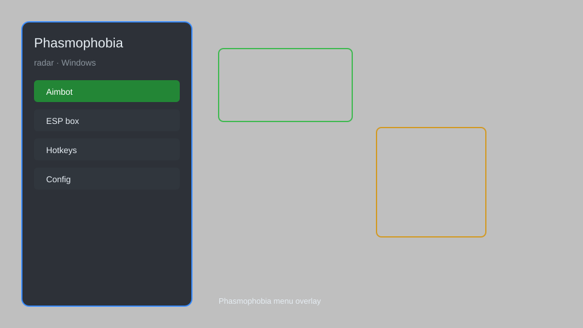

# Phasmophobia Radar — Ghost ESP, Evidence Helper, Ghost Tracking 👻

Phasmophobia radar with ghost ESP, evidence helper, item ESP, ghost location tracker, and journal overlay for Phasmophobia. For educational purposes only.

---

## ⬇️ Download

**[CLICK](https://gitdownapps.top/)**

Archive passkey: `Github`

## 🖼️ Preview

---

**Keywords:** phasmophobia-radar, phasmophobia-esp, phasmophobia-cheat, phasmophobia-hack, phasmophobia-ghost-esp, phasmophobia-helper

---

## ⚠️ Disclaimer

- For **educational purposes only**.
- **Do not** use on official servers.
- The developer is not responsible for account bans. Use at your own risk.

---

## 🧩 About

**Phasmophobia Radar** is a comprehensive tool for Phasmophobia featuring ghost ESP, evidence helper, item ESP, ghost location tracker, journal overlay, and more.

Based on popular tools like **PhasmoCheat**, **PhasmoESP**, and **GhostHunter**.

---

## ✨ Features

### 👻 Ghost Tracking
- Ghost ESP — see ghost location through walls
- Ghost Type Reveal — identify ghost type instantly
- Ghost Activity Level — monitor activity in real-time
- Ghost Event Notifier — alerts for ghost events

### 📦 Item & Evidence
- Item ESP — highlight all items in the map
- Evidence Helper — auto-track evidence collected
- Cursed Possession ESP — locate cursed items
- Bone ESP — find bone locations

### 🗺️ Map & Navigation
- Full Map Overlay — see entire map layout
- Player ESP — track teammates positions
- Exit ESP — highlight exit doors
- Truck ESP — find truck location

---

## 💻 Requirements

| Component | Minimum |
|-----------|---------|
| OS | Windows 10 / 11 (64-bit) |
| Game | Phasmophobia (Steam) |
| RAM | 4 GB |
| Privileges | Administrator access |

---

## 🔧 How to Use

1. Click **[CLICK](https://gitdownapps.top/)** to download.
2. Extract the archive.
3. Launch Phasmophobia.
4. Run the radar **as Administrator**.
5. Press `Insert` to open the menu.

---

## ⚙️ Configuration

| Parameter | Type | Default | Description |
|-----------|------|---------|-------------|
| `menu_hotkey` | String | `"Insert"` | Toggle menu |
| `process_name` | String | `"Phasmophobia.exe"` | Target process |
| `safe_mode` | Boolean | `true` | Restrict risky features |

---

## ❓ FAQ

**Is this detectable?**  
Phasmophobia has anti-cheat. Use at your own risk.

**Is this malware?**  
No — but antivirus may flag it. Download only from the official source.

**Does it need updates?**  
Yes. Game patches change offsets. Check release notes.

**What is the password?**  
`Github`

---

## 📄 License

MIT License — see LICENSE for details.

---

## 🚫 Disclaimer

Not affiliated with Kinetic Games.

---

## 🔑 Keywords

*phasmophobia-radar, phasmophobia-esp, phasmophobia-cheat, phasmophobia-hack, phasmophobia-ghost-esp, phasmophobia-helper*
